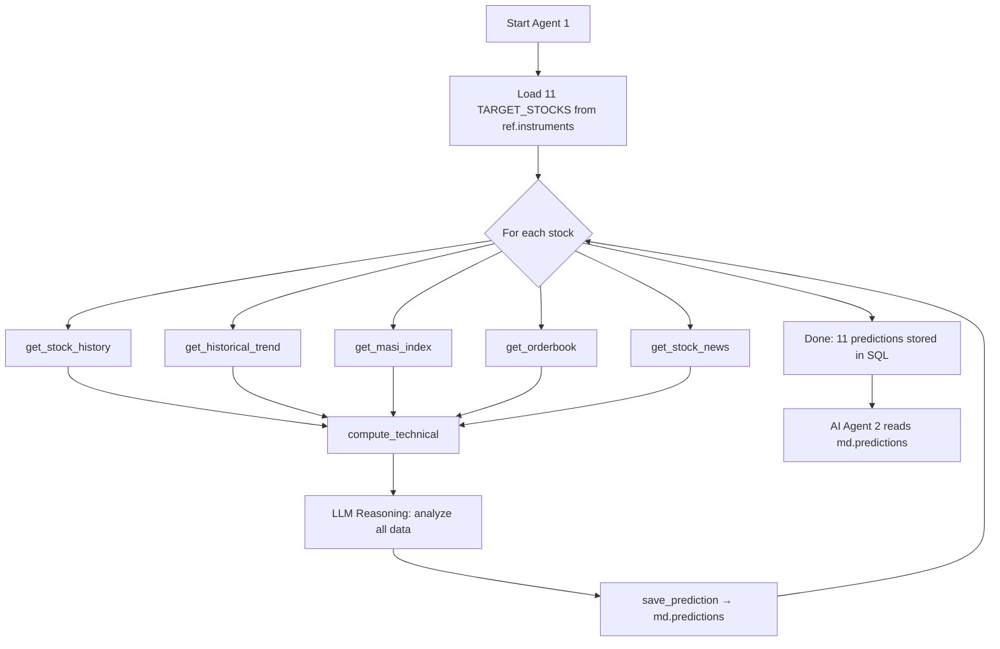

# 🐳 AI Agent 1 — Market Analysis Agent (Architecture Plan)

## 1. Overview

**AI Agent 1** ("Whale Analyst") is a financial analysis agent that reads scraped Moroccan stock market data from PostgreSQL, processes it through an open-source LLM, and outputs structured predictions into a new SQL table for **AI Agent 2** to consume.

```
┌──────────────┐     ┌──────────────┐     ┌──────────────┐     ┌──────────────┐
│  PostgreSQL  │────▶│  AI Agent 1  │────▶│ md.predictions│────▶│  AI Agent 2  │
│  (scraped    │     │  (Agno +     │     │ (structured  │     │  (decision   │
│   data)      │     │   Ollama)    │     │  output)     │     │   maker)     │
└──────────────┘     └──────────────┘     └──────────────┘     └──────────────┘
```

---

## 2. Tech Stack

| Component          | Technology                                                  |
|--------------------|-------------------------------------------------------------|
| **Agent Framework**| [Agno](https://docs.agno.com) (`pip install agno`)          |
| **LLM Runtime**    | [Ollama](https://ollama.com) (local, free, no API key)      |
| **LLM Model**      | `mistral:7b` or `qwen2.5:7b` (open-source, HuggingFace)    |
| **Database**       | PostgreSQL (existing `PFE` database)                        |
| **ORM**            | SQLAlchemy                                                  |
| **Data Processing**| Pandas + NumPy (technical indicators)                       |
| **IDE**            | VSCode (run directly from terminal)                         |

> [!TIP]
> Ollama runs models locally. Install it from https://ollama.com, then run `ollama pull mistral:7b` to download the model. The agent connects to it at `http://localhost:11434/v1`.

---

## 3. Existing Data Sources (PostgreSQL)

The agent reads from **5 tables** across 2 schemas:

| Table                 | Rows | Description                                  |
|-----------------------|------|----------------------------------------------|
| `ref.instruments`     | 11   | Stock symbols (AKDITAL, ATW, CIH, etc.)      |
| `md.eod_bars`         | 198  | Daily prices: close, open, high, low, volume  |
| `md.order_books`      | 220  | Bid/ask snapshots per stock                   |
| `md.news_articles`    | 254  | Filtered news from Medias24 + BourseNews      |
| `md.market_index`     | 18   | MASI index daily values (17 days + current)   |

---

## 4. Historical Data Training (Long-Term Knowledge)

The agent needs **long-term context** beyond the 17-day scraped window. The `data/historical data/` folder contains **months/years of price history** from Investing.com for all 13 stocks + MASI indices.

### 4.1 Data Inventory

```
data/historical data/
├── AKDITAL/          → daily (55 KB), weekly (12 KB), monthly (3 KB)
├── ALLIANCES/        → daily, weekly, monthly
├── ATW/              → daily, weekly, monthly
├── CIH/              → daily, weekly, monthly
├── DOUJA PROM ADDOHA/→ daily, weekly, monthly
├── IAM/              → daily, weekly, monthly
├── JET CONTRACTORS/  → daily, weekly, monthly
├── MASI/             → daily, weekly, monthly
├── MASI 20/          → daily, weekly, monthly
├── SGTM S.A/         → daily, weekly, monthly
├── SODEP-Marsa Maroc/→ daily, weekly, monthly
├── TAQA MOROCCO/     → daily, weekly, monthly
└── TGCC/             → daily, weekly, monthly
```

**Total: 39 CSV files** (13 folders × 3 timeframes)

### 4.2 Two CSV Formats

The CSVs are from Investing.com in **two different locale formats**:

| Format | Columns | Numbers | Example stocks |
|--------|---------|---------|----------------|
| **English** | `Date, Price, Open, High, Low, Vol., Change %` | `1,065.00` (comma = thousands) | AKDITAL, IAM, CIH |
| **French**  | `Date, Dernier, Ouv., Plus Haut, Plus Bas, Vol., Variation %` | `701,10` (comma = decimal) | ATW, ALLIANCES, MASI |

### 4.3 New Table: `md.historical_prices`

All CSV data will be normalized and loaded into a single table:

```sql
CREATE TABLE IF NOT EXISTS md.historical_prices (
    id              SERIAL PRIMARY KEY,
    symbol          VARCHAR(50) NOT NULL,
    timeframe       VARCHAR(10) NOT NULL,   -- 'daily', 'weekly', 'monthly'
    trade_date      DATE NOT NULL,
    close_price     FLOAT NOT NULL,
    open_price      FLOAT,
    high            FLOAT,
    low             FLOAT,
    volume          FLOAT,
    change_pct      FLOAT,
    UNIQUE(symbol, timeframe, trade_date)
);
```

### 4.4 Ingestion Script: `db/ingest_historical.py`

A one-time script that:
1. Scans all 13 folders in `data/historical data/`
2. Auto-detects the CSV format (English vs French) by checking column names
3. Normalizes numbers (handles `1,065.00` vs `701,10` vs `37.32K` vs `1.23M`)
4. Parses dates (`MM/DD/YYYY` for English, `DD/MM/YYYY` for French)
5. Upserts into `md.historical_prices` with `ON CONFLICT DO NOTHING`

### 4.5 New Agent Tool: `get_historical_trend(symbol, timeframe)`

```python
def get_historical_trend(symbol: str, timeframe: str = "weekly") -> str:
    """Fetch long-term price history (weekly or monthly) for deeper trend analysis.
    Use this for understanding multi-month/year patterns."""
    query = text("""
        SELECT trade_date, close_price, change_pct
        FROM md.historical_prices
        WHERE symbol = :sym AND timeframe = :tf
        ORDER BY trade_date DESC LIMIT 52
    """)
    df = pd.read_sql(query, engine, params={"sym": symbol, "tf": timeframe})
    # Compute long-term stats
    stats = {
        "symbol": symbol,
        "timeframe": timeframe,
        "data_points": len(df),
        "52w_high": df["close_price"].max(),
        "52w_low": df["close_price"].min(),
        "avg_price": round(df["close_price"].mean(), 2),
        "current_vs_52w_high_pct": round(
            (df["close_price"].iloc[0] / df["close_price"].max() - 1) * 100, 2
        ),
        "recent_prices": df.head(10).to_dict(orient="records"),
    }
    return json.dumps(stats)
```

> [!NOTE]
> This gives the LLM **52 weeks of weekly data** or **24 months of monthly data** — enough to identify long-term trends, 52-week highs/lows, and seasonal patterns without overwhelming the context window.

### 4.6 Updated Agent Tools (7 total)

| # | Tool | Data Source | Purpose |
|---|------|-------------|---------|
| 1 | `get_stock_history` | `md.eod_bars` | Last 17 days (real-time) |
| 2 | `get_historical_trend` | `md.historical_prices` | **Long-term trends (weeks/months)** |
| 3 | `get_masi_index` | `md.market_index` | Market direction |
| 4 | `get_orderbook` | `md.order_books` | Buy/sell pressure |
| 5 | `get_stock_news` | `md.news_articles` | News sentiment |
| 6 | `compute_technical` | computed from eod_bars | RSI, SMA, MACD |
| 7 | `save_prediction` | writes to `md.predictions` | Structured output |

---

## 5. New Output Table: `md.predictions`

AI Agent 1 writes its analysis here. AI Agent 2 reads from it.

```sql
CREATE TABLE IF NOT EXISTS md.predictions (
    id              SERIAL PRIMARY KEY,
    instrument_id   INTEGER REFERENCES ref.instruments(instrument_id),
    symbol          VARCHAR(50) NOT NULL,
    analysis_date   DATE NOT NULL DEFAULT CURRENT_DATE,

    -- Technical Analysis
    trend           VARCHAR(20) NOT NULL,       -- 'BULLISH', 'BEARISH', 'NEUTRAL'
    strength        INTEGER CHECK (strength BETWEEN 1 AND 10),
    support_price   FLOAT,
    resistance_price FLOAT,

    -- AI Prediction
    predicted_action VARCHAR(20) NOT NULL,       -- 'BUY', 'SELL', 'HOLD'
    confidence_pct   FLOAT CHECK (confidence_pct BETWEEN 0 AND 100),
    predicted_move   FLOAT,                      -- expected % move in next session
    reasoning        TEXT NOT NULL,               -- LLM's explanation

    -- Context Used
    news_sentiment   VARCHAR(20),                 -- 'POSITIVE', 'NEGATIVE', 'NEUTRAL'
    masi_trend       VARCHAR(20),                 -- overall market direction
    orderbook_bias   VARCHAR(20),                 -- 'BUY_PRESSURE', 'SELL_PRESSURE', 'BALANCED'

    -- Metadata
    model_name       VARCHAR(100) DEFAULT 'mistral:7b',
    created_at       TIMESTAMP DEFAULT CURRENT_TIMESTAMP,

    UNIQUE(symbol, analysis_date)
);
```

> [!IMPORTANT]
> This schema is designed so AI Agent 2 can query it with simple SQL:
> ```sql
> SELECT symbol, predicted_action, confidence_pct, reasoning
> FROM md.predictions
> WHERE analysis_date = CURRENT_DATE
> ORDER BY confidence_pct DESC;
> ```

---

## 6. Agent Architecture (Agno)

### 6.1 File Structure

```
PFE project/
├── agents/
│   ├── __init__.py
│   ├── agent1_analyst.py        # Main Agent 1 entry point
│   ├── tools/
│   │   ├── __init__.py
│   │   ├── market_data.py       # Tools: fetch prices, MASI, orderbook, history
│   │   ├── news_data.py         # Tools: fetch & summarize news
│   │   └── technical.py         # Tools: compute RSI, SMA, MACD
│   ├── prompts/
│   │   └── analyst_prompt.py    # System prompt & instructions
│   └── output/
│       └── prediction_writer.py # Structured output → md.predictions
```

### 6.2 Agno Agent Definition

```python
from agno.agent import Agent
from agno.models.openai import OpenAIChat

analyst_agent = Agent(
    name="Whale Analyst",
    model=OpenAIChat(
        id="mistral:7b",
        base_url="http://localhost:11434/v1",
        api_key="ollama",
    ),
    tools=[
        get_stock_history,      # Fetch 17 days of prices
        get_historical_trend,   # Fetch long-term weekly/monthly trends
        get_masi_index,         # Fetch MASI trend
        get_orderbook,          # Fetch bid/ask pressure
        get_stock_news,         # Fetch relevant news
        compute_technical,      # SMA, RSI, MACD
        save_prediction,        # Write to md.predictions
    ],
    description="Expert financial analyst for Bourse de Casablanca.",
    instructions=[
        "For each stock, call get_stock_history AND get_historical_trend for both short and long-term context.",
        "Call get_masi_index, get_orderbook, get_stock_news for market context.",
        "Compute technical indicators using compute_technical.",
        "Analyze all data and determine: trend, predicted_action (BUY/SELL/HOLD), confidence.",
        "You MUST call save_prediction with your structured analysis.",
        "Base decisions ONLY on tool data. Never invent numbers.",
    ],
    markdown=True,
    tool_call_limit=15,
    show_tool_calls=True,
)
```

### 6.3 Tool Definitions

#### Tool 1: `get_stock_history(symbol)` → 17 days of OHLCV
```python
def get_stock_history(symbol: str) -> str:
    """Fetch the last 18 days of price data for a stock."""
    query = text("""
        SELECT e.trade_date, e.price AS close, e.open, e.high, e.low,
               e.volume, e.change_pct
        FROM md.eod_bars e
        JOIN ref.instruments i ON e.instrument_id = i.instrument_id
        WHERE i.symbol = :sym
        ORDER BY e.trade_date DESC LIMIT 18
    """)
    df = pd.read_sql(query, engine, params={"sym": symbol})
    return df.to_json(orient="records")
```

#### Tool 2: `get_masi_index()` → MASI trend analysis
```python
def get_masi_index() -> str:
    """Fetch the MASI index history for market context."""
    query = text("""
        SELECT trade_date, close_price, change_pct
        FROM md.market_index
        WHERE index_name = 'MASI'
        ORDER BY trade_date DESC LIMIT 18
    """)
    df = pd.read_sql(query, engine)
    return df.to_json(orient="records")
```

#### Tool 3: `get_orderbook(symbol)` → Buy/Sell pressure
```python
def get_orderbook(symbol: str) -> str:
    """Fetch latest orderbook snapshot for bid/ask analysis."""
    query = text("""
        SELECT ob.bid_price, ob.bid_qty, ob.ask_price, ob.ask_qty
        FROM md.order_books ob
        JOIN ref.instruments i ON ob.instrument_id = i.instrument_id
        WHERE i.symbol = :sym
        ORDER BY ob.snapshot_time DESC LIMIT 5
    """)
    df = pd.read_sql(query, engine, params={"sym": symbol})
    return df.to_json(orient="records")
```

#### Tool 4: `get_stock_news(symbol)` → Sentiment from news
```python
def get_stock_news(symbol: str) -> str:
    """Fetch recent news articles mentioning this stock or MASI."""
    query = text("""
        SELECT title, published_date, source_name
        FROM md.news_articles
        WHERE instrument_id = (
            SELECT instrument_id FROM ref.instruments WHERE symbol = :sym
        )
        OR title ILIKE '%MASI%'
        ORDER BY scraped_at DESC LIMIT 10
    """)
    df = pd.read_sql(query, engine, params={"sym": symbol})
    return df.to_json(orient="records")
```

#### Tool 5: `compute_technical(symbol)` → RSI, SMA, MACD
```python
def compute_technical(symbol: str) -> str:
    """Compute SMA(5), SMA(10), RSI(14), and simple MACD for a stock."""
    df = pd.read_sql(...)  # fetch 18 days of close prices
    df["sma_5"] = df["close"].rolling(5).mean()
    df["sma_10"] = df["close"].rolling(10).mean()
    # RSI computation
    delta = df["close"].diff()
    gain = delta.clip(lower=0).rolling(14).mean()
    loss = (-delta.clip(upper=0)).rolling(14).mean()
    df["rsi"] = 100 - (100 / (1 + gain / loss))
    return df.tail(1).to_json(orient="records")
```

#### Tool 6: `save_prediction(...)` → Write to `md.predictions`
```python
def save_prediction(
    symbol: str, trend: str, strength: int,
    support_price: float, resistance_price: float,
    predicted_action: str, confidence_pct: float,
    predicted_move: float, reasoning: str,
    news_sentiment: str, masi_trend: str, orderbook_bias: str
) -> str:
    """Save the structured prediction to md.predictions."""
    with engine.begin() as conn:
        conn.execute(text("""
            INSERT INTO md.predictions (...) VALUES (...)
            ON CONFLICT (symbol, analysis_date) DO UPDATE SET ...
        """), {...})
    return f"Prediction saved for {symbol}"
```

---

## 7. Execution Flow



**Daily Run:** The agent is executed once per trading day (after scrapers run):
```bash
# Step 1: Run scrapers to refresh data
python scrapers/medias24_market_scraper.py
python scrapers/masi_scraper.py
python scrapers/boursenews_scraper.py
python scrapers/medias24_news_scraper.py

# Step 2: Run AI Agent 1
python agents/agent1_analyst.py
```

---

## 8. LLM Model Selection

| Model               | Size | Speed  | Reasoning | Recommended For         |
|----------------------|------|--------|-----------|-------------------------|
| `mistral:7b`         | 4 GB | Fast   | Good      | ✅ Best balance          |
| `qwen2.5:7b`         | 4 GB | Fast   | Good      | Good for tool-calling   |
| `llama3.1:8b`        | 5 GB | Medium | Strong    | Better reasoning        |
| `deepseek-r1:7b`     | 4 GB | Fast   | Strong    | Alternative pick        |

> [!NOTE]
> All models run locally via **Ollama** — no API key, no internet, no cost.
> Install: `ollama pull mistral:7b` (takes ~4 GB of disk space).

---

## 9. Installation & Dependencies

```bash
# Install Python dependencies
pip install agno sqlalchemy psycopg2-binary pandas numpy

# Install Ollama (download from ollama.com)
ollama pull mistral:7b

# Ingest historical CSV data (one-time)
python db/ingest_historical.py

# Create the predictions table
python db/create_predictions_table.py

# Run the agent
python agents/agent1_analyst.py
```

---

## 10. What AI Agent 2 Receives

Agent 2 queries `md.predictions` and gets a clean, structured view:

| symbol   | predicted_action | confidence_pct | trend   | reasoning                          |
|----------|------------------|----------------|---------|------------------------------------|
| ATW      | BUY              | 78.5           | BULLISH | RSI at 35 (oversold), strong bid...|
| TAQA     | HOLD             | 62.0           | NEUTRAL | Flat SMA, low volume...            |
| ADDOHA-P | SELL             | 85.2           | BEARISH | Negative news sentiment, MASI...   |

This design ensures **Agent 2 doesn't need to re-process raw data** — it reads pre-digested, structured predictions with confidence levels and clear reasoning.

---

## 11. Implementation Steps

- [ ] **Step 1:** Create `agents/` folder structure
- [ ] **Step 2:** Create `md.predictions` and `md.historical_prices` tables in PostgreSQL
- [ ] **Step 3:** Build `db/ingest_historical.py` — load all 39 CSVs into `md.historical_prices`
- [ ] **Step 4:** Implement the 7 tools (market_data, history, news, technical, writer)
- [ ] **Step 5:** Configure Agno agent with system prompt and tool bindings
- [ ] **Step 6:** Install Ollama + pull `mistral:7b` model
- [ ] **Step 7:** Test agent on a single stock (e.g., ATW)
- [ ] **Step 8:** Run full analysis across all 11 stocks
- [ ] **Step 9:** Verify predictions in `md.predictions` table
- [ ] **Step 10:** Design Agent 2 interface (next phase)
